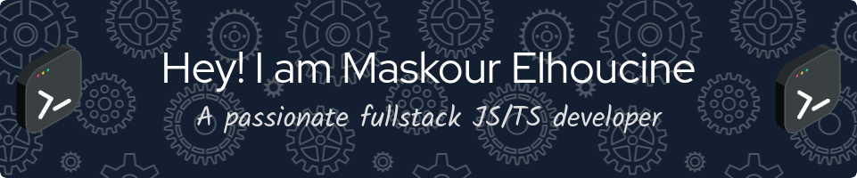

  

  

  

- 🔭 I’m currently working on **CryptoNexus: A Comprehensive Platform for Cryptocurrency News, Exchange Listings, and Market Analysis**

- 🌱 I’m currently learning **Rust(Rocket & Actix), GO**

- 👯 I’m looking to collaborate on **AgroChain: A Blockchain-Based Smart Contract Supply Chain Solution for the Agro-Food Industry**

- 🤝 I’m looking for help with **Web-based e-commerce platform for a niche market**

- 📝 I regularly write articles on [https://www.overleaf.com/](https://www.overleaf.com/)

- 💬 Ask me about **Nestjs, Vuejs**

- 📫 How to reach me **elhoucine.maskour7@gmail.com**

- ⚡ Fun fact **The world's largest ant colony was found in 2000, it stretches over 3,700 miles.**

<h3 align="left">Connect with me:</h3>

  

<h3 align="left">Languages and Tools:</h3>

                                                       

 

 
  
 
    <h3> 💡 Some of my projects </h3>
  

   
  

    
  

 

  

&nbsp;

